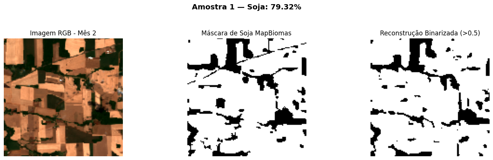

# Detecção de Soja com U-Net e MapBiomas

----------

----------

## Introdução

Este projeto apresenta o desenvolvimento de uma U-Net 3D para detecção e segmentação de áreas de soja a partir de imagens multiespectrais de satélite. O modelo é treinado de forma supervisionada com dados do MapBiomas, explorando a variação temporal das bandas espectrais para identificar padrões relacionados ao cultivo da soja. A arquitetura convolucional 3D captura simultaneamente informações espaciais e temporais, enquanto a função de perda híbrida, combinando Binary Cross-Entropy e Dice Loss balanceada, busca otimizar a precisão da segmentação mesmo em cenários com forte desbalanceamento entre classes.

## Dataset

O dataset utilizado neste projeto foi construído a partir de imagens de satélite multitemporais e mapas de cobertura do solo do MapBiomas, armazenados em formato .npy com dimensões (N, 128, 128, 7, 5), onde N representa o número de amostras. Cada amostra contém sete canais espectrais, RGB (vermelho, verde e azul), infravermelho próximo (NIR), NDVI, NDWI e a máscara de soja, distribuídos em cinco meses consecutivos (outubro, novembro, dezembro, janeiro e fevereiro), correspondentes à safra 2021. As imagens foram coletadas para os estados do Rio Grande do Sul e Paraná, que, entre os quatro maiores produtores de soja do Brasil, foram os únicos com dados disponíveis após a aplicação de um filtro rigoroso de cobertura de nuvens igual a 1%.

### Extração das *Features*

<strong>Extração das <em>features</em>

  

  
A região destacada em amarelo representa a área da qual as <em>features</em> foram extraídas.

### Arquivo `.npy` para Treinamento

Você também pode carregar diretamente o arquivo `.npy` com dataset:

🔗 [Download do dataset `dataset.npy` no Google Drive](https://drive.google.com/file/d/1ZTY4oiZTJBYCCkL-T12e3YQHeJavtbkP/view?usp=sharing)

## Resultados

<strong>Resultados da detecção de áreas de soja

  

## Licença

Este projeto está licenciado sob a licença MIT - veja o arquivo LICENSE para detalhes.
